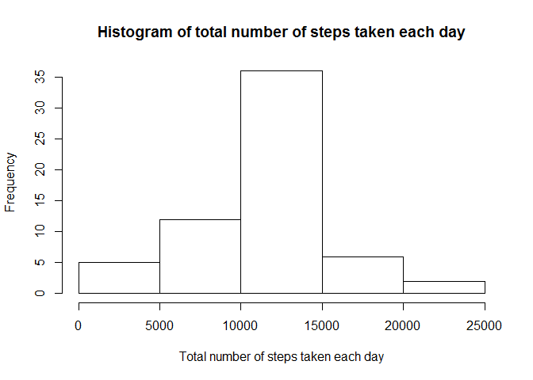

# Reproducible Research: Peer Assessment 1

## Loading and preprocessing the data
Reading in the dataset:

```r
unzip(zipfile = "activity.zip")
data <- read.csv("activity.csv")
```

## What is mean total number of steps taken per day?
Histogram of the total number of steps taken each day:

```r
library(ggplot2)
total_steps <- tapply(data$steps, data$date, FUN = sum, na.rm = TRUE)
qplot(total_steps, xlab = "Total number of steps taken per day")
```

 

Mean and median number of steps taken each day:

```r
mean(total_steps, na.rm = TRUE)
```

```
## [1] 9354.23
```

```r
median(total_steps, na.rm = TRUE)
```

```
## [1] 10395
```

## What is the average daily activity pattern?
Time series plot of the average number of steps taken (averaged across all days) versus the 5-minute intervals:

```r
data_mean <- aggregate(x = list(steps = data$steps), by = list(interval = data$interval), FUN = mean, na.rm = TRUE)
ggplot(data = data_mean, aes(x = interval, y = steps)) + geom_line() + xlab("5-minute interval") + ylab("Average number of steps taken")
```

 

5-minute interval that, on average, contains the maximum number of steps:

```r
data_mean[which.max(data_mean$steps), ]
```

```
##     interval    steps
## 104      835 206.1698
```

## Imputing missing values

```r
missing_values <- is.na(data$steps)
table(missing_values)
```

```
## missing_values
## FALSE  TRUE 
## 15264  2304
```

Copy the data and replace missing entires with the mean for that time interval:

```r
data_no_na <- data
replace_na_value <- tapply(data$steps, data$interval, FUN = mean, na.rm = TRUE)
for (i in which(is.na(data_no_na)))
{
  data_no_na[i, 1] <- replace_na_value[((i-1) %% 288) + 1]
}
```

Histogram of total number of steps taken each day after missing values were imputed:

```r
hist(tapply(data_no_na$steps, data_no_na$date, FUN = sum), main = "Histogram of total number of steps taken each day", xlab="Total number of steps taken each day")
```

 

```r
total_steps_no_na <- tapply(data_no_na$steps, data_no_na$date, FUN = sum)
mean(total_steps_no_na)
```

```
## [1] 10766.19
```

```r
median(total_steps_no_na)
```

```
## [1] 10766.19
```

## Are there differences in activity patterns between weekdays and weekends?
Panel plot comparing the average number of steps taken per 5-minute interval across weekdays and weekends:

```r
weekday_weekend <- function(date) {
    day <- weekdays(date)
    if (day %in% c("Saturday", "Sunday"))
        return("weekend")
    else
        return("weekday")
}
data_no_na$date <- as.Date(data_no_na$date)
data_no_na$day <- sapply(data_no_na$date, FUN = weekday_weekend)

data_no_na_mean <- aggregate(steps ~ interval + day, data = data_no_na, FUN = mean)
ggplot(data_no_na_mean, aes(interval, steps)) + geom_line() + facet_grid(day ~ .) + xlab("5-minute interval") + ylab("Number of steps")
```

 
